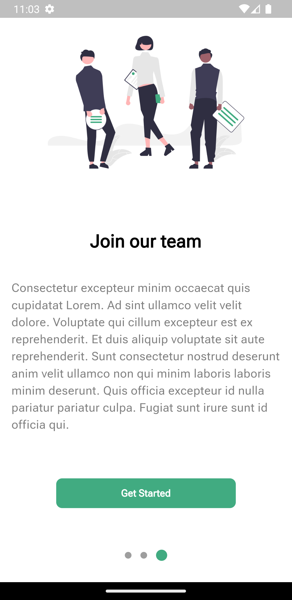

# onboarding

# Flutter Onboarding

This Flutter project demonstrates the implementation of an onboarding experience in a mobile app. The onboarding process is an essential component of user engagement, helping new users understand the app's features and benefits. This repository provides a ready-to-use template for creating an onboarding flow with three pages, complete with smooth transitions and customizable content.

## Screenshots

Here are a few screenshots from the app:

  
  
  

## Features

- Three interactive onboarding pages with appealing UI.
- Smooth transitions between pages using animated page indicators.
- Easy-to-use and customizable content for each onboarding page.
- Fully responsive design that adapts to different screen sizes.
- Codebase written in Flutter, ensuring cross-platform compatibility.

## Getting Started

To get started with this project, follow these steps:

1. Clone the repository:
git clone https://github.com/ADEL-tec/Onboarding.git

2. Navigate to the project directory:
  cd onboarding

3. Install the dependencies:
  flutter pub get

4. Run the app:
  flutter run

## Customization

To customize the onboarding experience for your app, you can modify the following files:

- `lib/main.dart`: Update the colors, fonts, or additional theme properties to match your app's branding.
- `lib/screens/onboarding_screen.dart`: Customize the content, images, and transition animations for each onboarding page.

Feel free to explore the code and make any necessary changes to fit your specific requirements.

## Dependencies

This project utilizes the following dependencies:

- [flutter_bloc](https://pub.dev/packages/flutter_bloc): Flutter package for managing application state and implementing the BLoC (Business Logic Component) design pattern. Version: 8.1.3
- [dots_indicator](https://pub.dev/packages/dots_indicator): Flutter package for displaying dot indicators to represent the current position in a page view. Version: 3.0.0
- [flutter_screenutil](https://pub.dev/packages/flutter_screenutil): Flutter package for designing responsive UI by adapting to different screen sizes. Version: 5.8.4

You can find the specific versions of these dependencies in the `pubspec.yaml` file.

## Contribution

Contributions to this project are welcome! If you encounter any issues or would like to add new features, please feel free to submit a pull request.

## License

This project is licensed under the [MIT License](LICENSE). You are free to use, modify, and distribute the code for personal and commercial purposes.

## Acknowledgments

- The Flutter team for providing a powerful framework for building beautiful apps.
- The creators and maintainers of the dependencies used in this project.

Thank you for checking out this Flutter Onboarding project! If you have any questions or suggestions, feel free to reach out.

